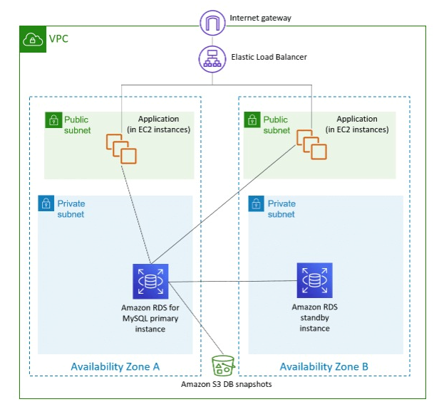
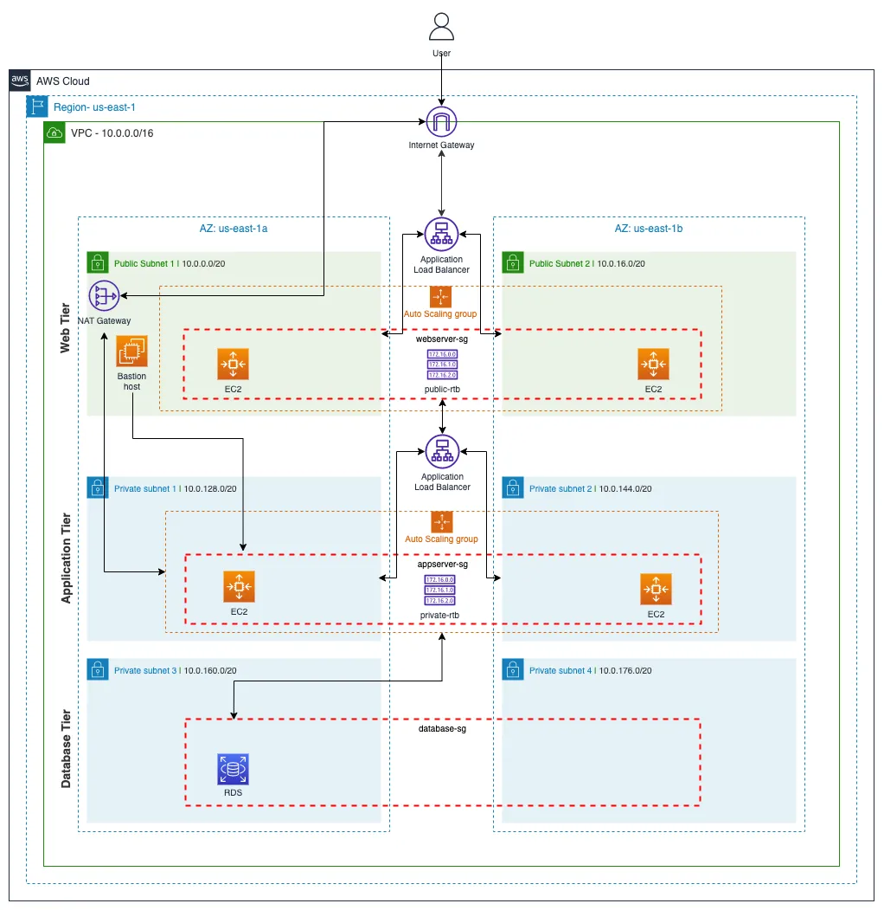
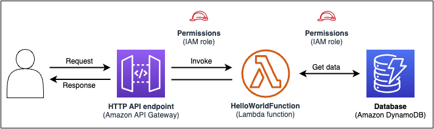

# Theoretical-Environment-Set-Up
test task to create stateless web applications.
You can use some of these strategies.

Ideas to create three separate stateless web applications in a cloud environment.  

1. This is simple statless architecture from web app in AWS.  
High avialiability duplicated architecture has been placed in a second Availability Zone to ensure business continuity if an Availability Zone fails. The Elastic Load Balancer splits the traffic between the two instance fleets. However, the primary database instance still manages all the traffic. A standby instance is created to duplicate the primary database in another Availability Zone, which protects application data if the primary database Availability Zone fails. Snapshots of the database are stored in Amazon Simple Storage Service (Amazon S3)
We can use aws service:
- VPC (security groups, public, private networks, internet gateway, nat getaway)  
- a few aviliability zones
- ELB (classic, ALB, NLB)
- autoscalling group 
- databases (RDS, Aurora, Dynamo DB)  

2. Next best practice create three tier application for hight aviliability, redundancy, loosely couple, stateless and security. 

  

3. I like this concepts full serverless application using serverless services by AWS.  
Usually using next services:
- API Getaway;  
- Lambda;  
- S3 or databases (DynamoDB, RDS)
- SNS, SQS.

